---
hide:
  - navigation
  - toc
---

    

        <button
            type="button"
            class="md-button lupaxa-button filter-panel-expand"
            data-filter-expand
            aria-expanded="false"
        >
            
            <svg xmlns="http://www.w3.org/2000/svg" viewBox="0 0 24 24" focusable="false">
                <path d="M6 13h12v-2H6m-3-5v2h18V6M10 18h4v-2h-4v2Z"/>
            </svg>
        
        
            <svg xmlns="http://www.w3.org/2000/svg" viewBox="0 0 24 24" focusable="false">
                <path d="M14.76 20.83 17.6 18l-2.84-2.83 1.41-1.41L19 16.57l2.83-2.81 1.41 1.41L20.41 18l2.83 2.83-1.41 1.41L19 19.41l-2.83 2.83-1.41-1.41M6 13h7.07c.14-.71.4-1.38.76-2H6m-3-5v2h18V6H3Z"/>
            </svg>
        
            Show Filters
        </button>
        

            Showing…
        

    

  

    <label for="article-search">Search articles</label>
    <input
      id="article-search"
      type="search"
      placeholder="Search by title, description, or tag"
      autocomplete="off"
      data-article-search
    />
  

  

    <label for="article-category">Tag</label>
    <select id="article-category" data-article-category>
      <option value="">All Tags</option>
    </select>
  

  

    <label id="article-status-label">View Articles</label>
    

      <button
        type="button"
        class="filter-panel-toggle__option"
        data-article-status="all"
        aria-pressed="true"
      >
        All
      </button>
      <button
        type="button"
        class="filter-panel-toggle__option"
        data-article-status="new"
        aria-pressed="false"
      >
        New
      </button>
    

  

  

    <label id="article-sort-label">Sort</label>
    

      <button
        type="button"
        class="filter-panel-toggle__option"
        data-article-sort="alpha"
        aria-pressed="true"
      >
        A–Z
      </button>
      <button
        type="button"
        class="filter-panel-toggle__option"
        data-article-sort="newest"
        aria-pressed="false"
      >
        Newest
      </button>
    

  

  

    <button
      type="button"
      class="md-button lupaxa-button filter-panel-clear"
      data-article-clear
    >
      Clear filters
    </button>
  

-   **[Certificates Without the Jargon](articles/certificates-without-the-jargon.md)**

    ---

    { class="catalogue-logo" data-publish-date="2026-08-01" }

    X.509 certificates in plain language. Keys, CSRs, self-signed versus CA-
    signed, trust stores, and what actually matters when you generate certs
    for tools and tests.

    Security
    Tools

-   **[CLI Design](articles/cli-design.md)**

    ---

    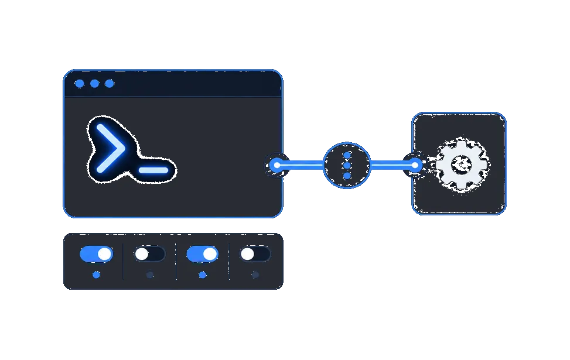{ class="catalogue-logo" data-publish-date="2026-08-01" }

    Practical CLI design for open-source tools. Flags and arguments, exit
    codes, stdout versus stderr, helpful errors, and interfaces that feel
    good in scripts and in human hands.

    Engineering
    Tools

-   **[Coding Standards](articles/coding-standards.md)**

    ---

    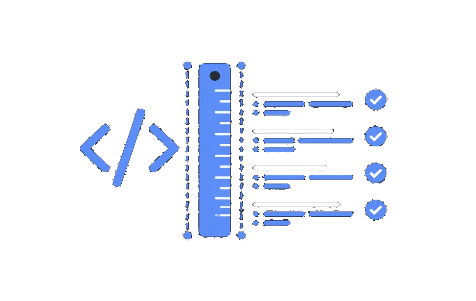{ class="catalogue-logo" data-publish-date="2026-08-01" }

    What coding standards actually cover, why they save review time, and how
    to enforce them with linters, formatters, CI checks, editor settings,
    and hooks instead of nagging.

    Engineering
    Standards

-   **[Config Design](articles/config-design.md)**

    ---

    { class="catalogue-logo" data-publish-date="2026-08-01" }

    Practical configuration design for tools. Flags, environment variables,
    files, precedence, secrets, and defaults that stay understandable as
    projects grow.

    Engineering
    Tools

-   **[Containers for CLI Tools](articles/containers-for-cli-tools.md)**

    ---

    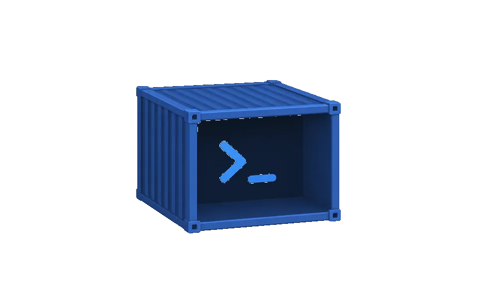{ class="catalogue-logo" data-publish-date="2026-08-01" }

    When and how to ship a CLI tool as a container. Pinning base images,
    running as non-root, keeping the attack surface small, and avoiding
    container anti-patterns for simple utilities.

    Security
    Tools

-   **[Contributing Without the Drama](articles/contributing-without-the-drama.md)**

    ---

    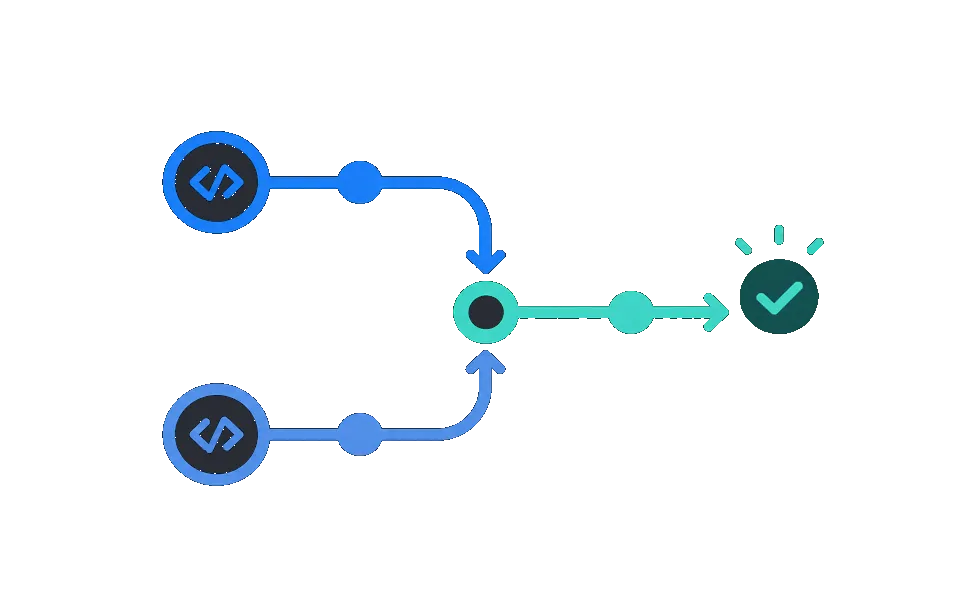{ class="catalogue-logo" data-publish-date="2026-08-01" }

    How to open issues and pull requests people actually want to merge.
    Small diffs, clear context, real reproduction steps, and knowing when an
    argument is not worth having.

    Open Source
    Community

-   **[Cybersecurity & Chess](articles/cybersecurity-and-chess.md)**

    ---

    { class="catalogue-logo" data-publish-date="2026-08-01" }

    The strategic parallels between cybersecurity and chess. Reading your
    opponent, adapting when the board changes, keeping tactics in service of
    strategy, and taking risks you have actually priced.

    Security
    Strategy

-   **[Dependency Hygiene](articles/dependency-hygiene.md)**

    ---

    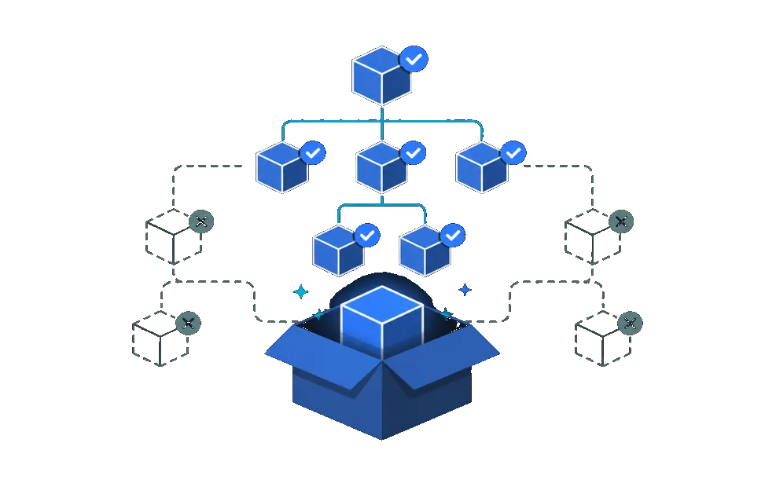{ class="catalogue-logo" data-publish-date="2026-08-01" }

    Practical dependency hygiene for small teams and open-source projects.
    Pinning, lockfiles, audits, supply-chain basics, and keeping your supply
    line trustworthy without enterprise ceremony.

    Security
    Engineering

-   **[Deprecation Without Chaos](articles/deprecation-without-chaos.md)**

    ---

    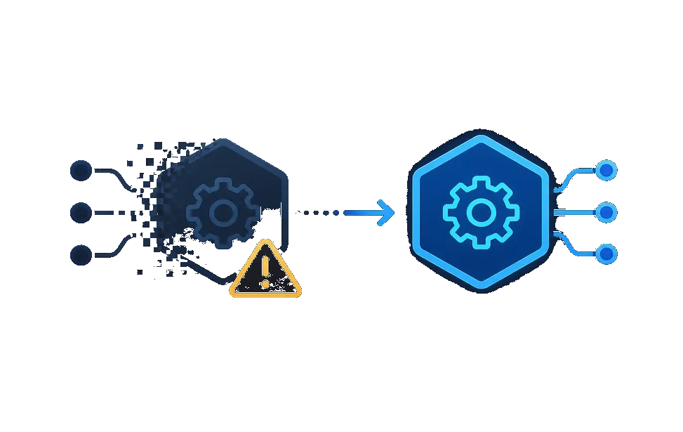{ class="catalogue-logo" data-publish-date="2026-08-01" }

    How to retire APIs and flags without ambushing anyone. Warnings people
    actually see, version gates they can plan around, cheap migrations, and
    removals that happen on purpose.

    Open Source
    Engineering

-   **[Docs That Don't Rot](articles/docs-that-dont-rot.md)**

    ---

    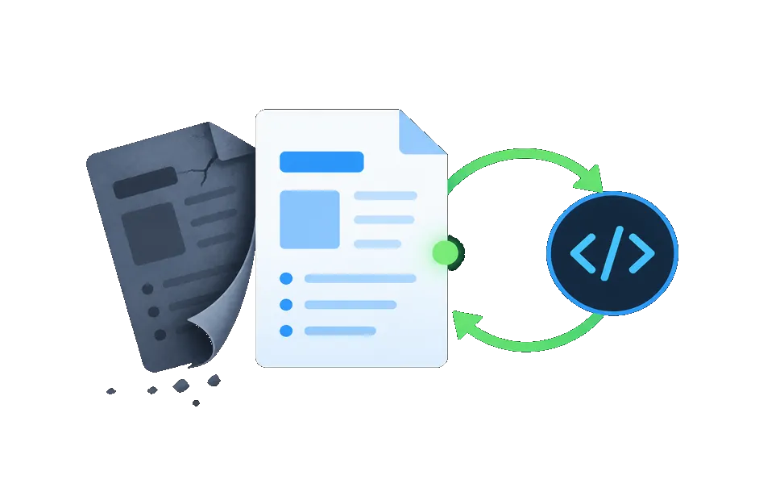{ class="catalogue-logo" data-publish-date="2026-08-01" }

    How to keep project documentation alive. Examples as tests, docs sites
    that ship with releases, screenshots that stay honest, and habits that
    stop docs from quietly lying.

    Documentation
    Open Source

-   **[Encryption at Rest for Repos](articles/encryption-at-rest-for-repos.md)**

    ---

    { class="catalogue-logo" data-publish-date="2026-08-01" }

    Encrypting secrets inside Git repositories. When git-crypt and similar
    tools help, where key management goes wrong, and safer patterns for
    small teams.

    Security
    Git

-   **[Error Handling People Can Use](articles/error-handling-people-can-use.md)**

    ---

    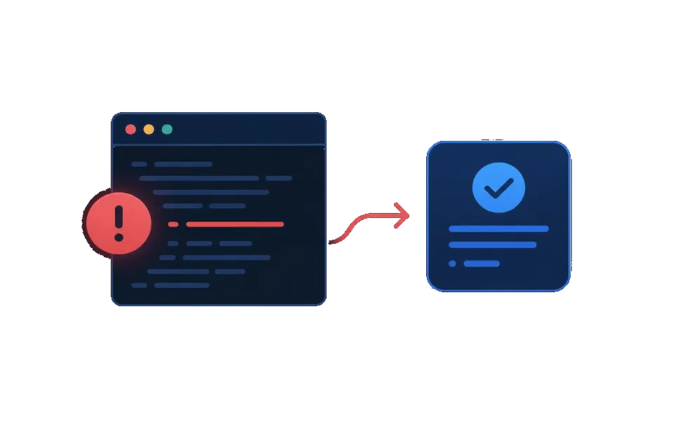{ class="catalogue-logo" data-publish-date="2026-08-01" }

    Practical error handling for CLIs and libraries. Clear messages, exit
    codes, retries, typed failures, and when to crash versus recover.

    Engineering
    Tools

-   **[Git Workflows for Tiny Teams](articles/git-workflows-for-tiny-teams.md)**

    ---

    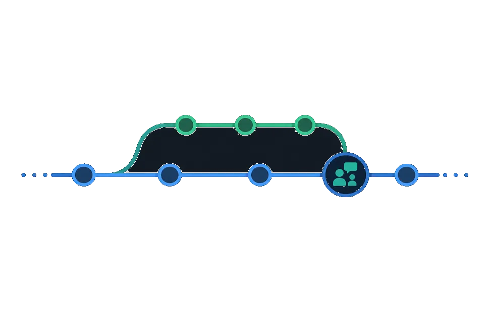{ class="catalogue-logo" data-publish-date="2026-08-01" }

    Practical Git workflows for small teams and solo maintainers. Trunk-
    based development, short-lived branches, pull requests, and release tags
    without enterprise branching theatre.

    Engineering
    Process

-   **[GitHub Actions](articles/github-actions.md)**

    ---

    { class="catalogue-logo" data-publish-date="2026-08-01" }

    Build a working CI/CD pipeline with GitHub Actions, from a first build-
    and-test workflow to deploying an artefact, with the YAML to copy and
    the habits that keep workflows fast and safe.

    CI/CD
    GitHub

-   **[Input Validation That Sticks](articles/input-validation-that-sticks.md)**

    ---

    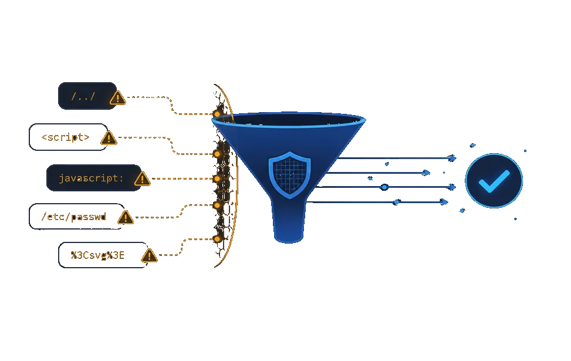{ class="catalogue-logo" data-publish-date="2026-08-01" }

    Practical input validation for CLIs and small services. Paths, URLs,
    subprocesses, sizes, and the failure modes that let an attacker steer
    your tool.

    Security
    Engineering

-   **[Key Lifecycle](articles/key-lifecycle.md)**

    ---

    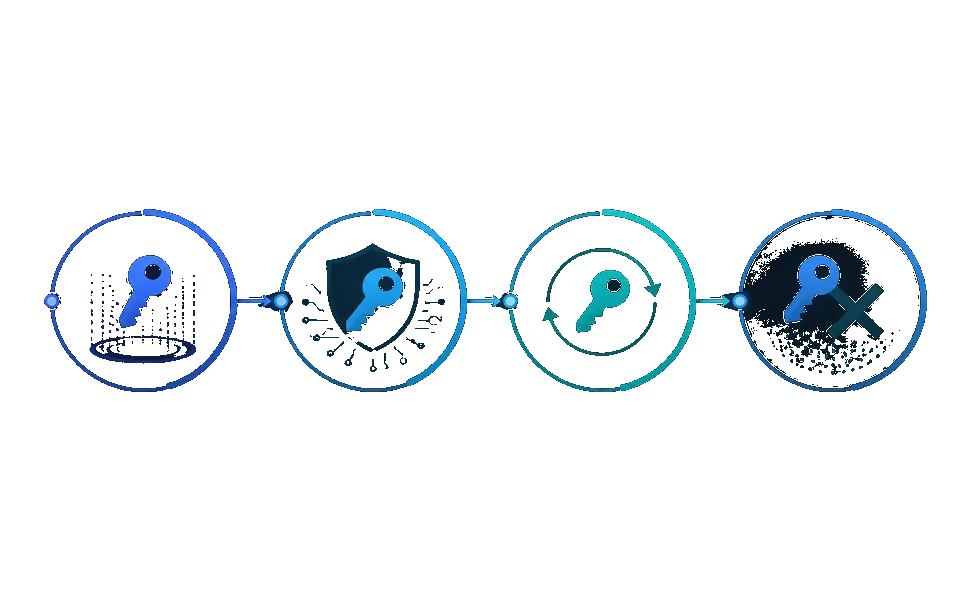{ class="catalogue-logo" data-publish-date="2026-08-01" }

    The key lifecycle for small security tools. Generate, distribute,
    rotate, revoke, and retire cryptographic keys and certificates without
    drama.

    Security
    Engineering

-   **[Least Privilege for CI](articles/least-privilege-for-ci.md)**

    ---

    { class="catalogue-logo" data-publish-date="2026-08-01" }

    Hardening CI/CD credentials. Short-lived tokens, OIDC, protected
    environments, and the GitHub Actions patterns that keep long-lived
    secrets out of your pipelines.

    Security
    CI/CD

-   **[Licenses for Humans](articles/licenses-for-humans.md)**

    ---

    { class="catalogue-logo" data-publish-date="2026-08-01" }

    A plain-language guide to open-source licenses for people publishing
    tools. MIT, Apache-2.0, and the GPL family, what each one asks of your
    users, and how to choose without a law degree.

    Open Source
    Community

-   **[Maintainer Boundaries](articles/maintainer-boundaries.md)**

    ---

    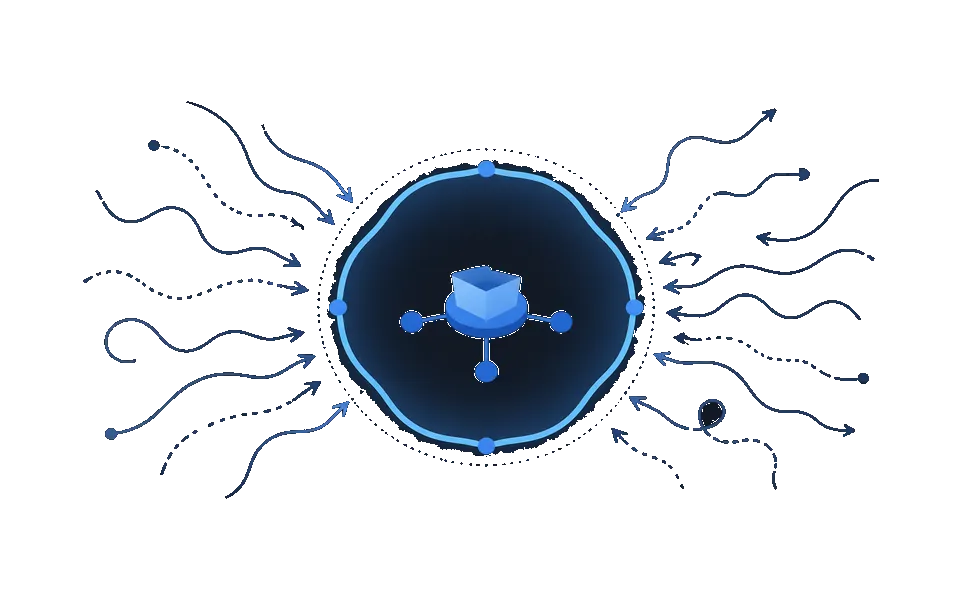{ class="catalogue-logo" data-publish-date="2026-08-01" }

    How open-source maintainers stay in the game. Write down scope, decline
    without writing an essay, publish honest support expectations, and
    protect review time before it runs out.

    Open Source
    Community

-   **[mTLS and Client Certificates](articles/mtls-and-client-certificates.md)**

    ---

    { class="catalogue-logo" data-publish-date="2026-08-01" }

    Mutual TLS and client certificates in practice. How they differ from
    ordinary HTTPS, when they are worth the trouble, and how small tools
    should issue and verify them.

    Security
    Certificates

-   **[Observability for Small Projects](articles/observability-for-small-projects.md)**

    ---

    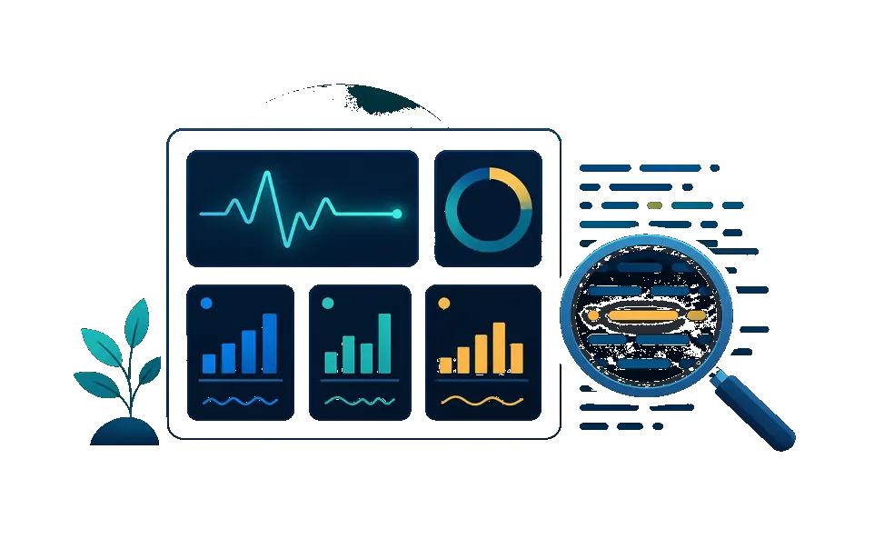{ class="catalogue-logo" data-publish-date="2026-08-01" }

    Practical observability for CLIs, libraries, and small services. Useful
    logs, health signals, failure modes, and knowing what broke without
    needing an enterprise APM stack.

    Engineering
    DevOps

-   **[Practical SECURITY.md](articles/practical-security-md.md)**

    ---

    { class="catalogue-logo" data-publish-date="2026-08-01" }

    A practical SECURITY.md playbook for small projects. What to include,
    example structure, scope statements, and making the security policy easy
    to find and follow.

    Security
    Open Source

-   **[Programming Fundamentals](articles/programming-fundamentals.md)**

    ---

    { class="catalogue-logo" data-publish-date="2026-08-01" }

    Why the principles underneath programming outlast any single language,
    and how a grip on algorithms, data structures, and design makes picking
    up new syntax the easy part.

    Engineering
    Fundamentals

-   **[README as Product](articles/readme-as-product.md)**

    ---

    { class="catalogue-logo" data-publish-date="2026-08-01" }

    Your README is the product page for an open-source project. Install
    steps that work, examples that ran, badges that tell the truth, and the
    shortest path from curiosity to a first success.

    Open Source
    Documentation

-   **[Red Team vs Blue Team](articles/red-team-vs-blue-team.md)**

    ---

    { class="catalogue-logo" data-publish-date="2026-08-01" }

    What Red Teams and Blue Teams actually do, why running them against each
    other finds the weaknesses a questionnaire never will, and where Purple,
    Green, and White Teams fit around them.

    Security
    Ops

-   **[Release Automation](articles/release-automation.md)**

    ---

    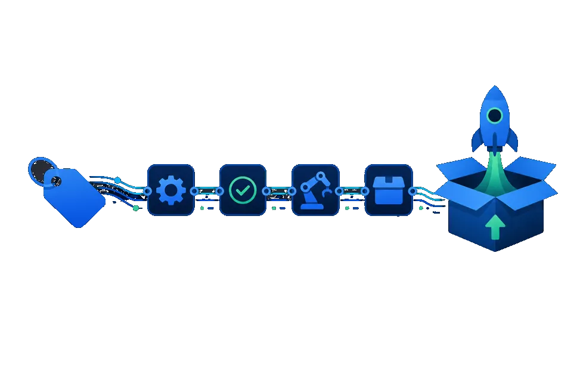{ class="catalogue-logo" data-publish-date="2026-08-01" }

    How to make releases boring. Tags as the source of truth, changelogs
    people can read, scoped publishing tokens, and CI guardrails that stop a
    bad release before it reaches a registry.

    CI/CD
    Open Source

-   **[Reproducible Builds](articles/reproducible-builds.md)**

    ---

    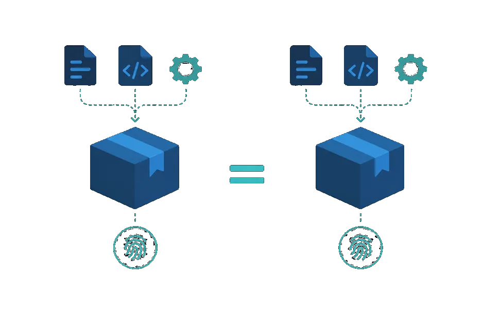{ class="catalogue-logo" data-publish-date="2026-08-01" }

    Lightweight reproducible builds for small tools. Pinning inputs, killing
    nondeterminism, and getting to bit-for-bit or near-identical releases
    without enterprise ceremony.

    Security
    Engineering

-   **[Responsible Dependency Updates](articles/responsible-dependency-updates.md)**

    ---

    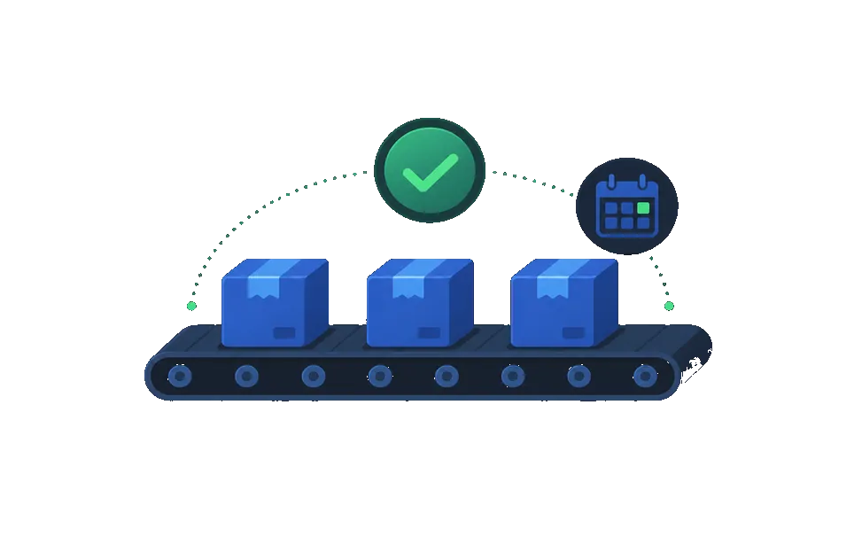{ class="catalogue-logo" data-publish-date="2026-08-01" }

    A practical cadence for dependency updates. Dependabot-style PRs, ignore
    rules, reading majors, and keeping upgrades boring without ignoring
    security fixes.

    Security
    Engineering

-   **[Right Tools for the Job](articles/right-tools-for-the-job.md)**

    ---

    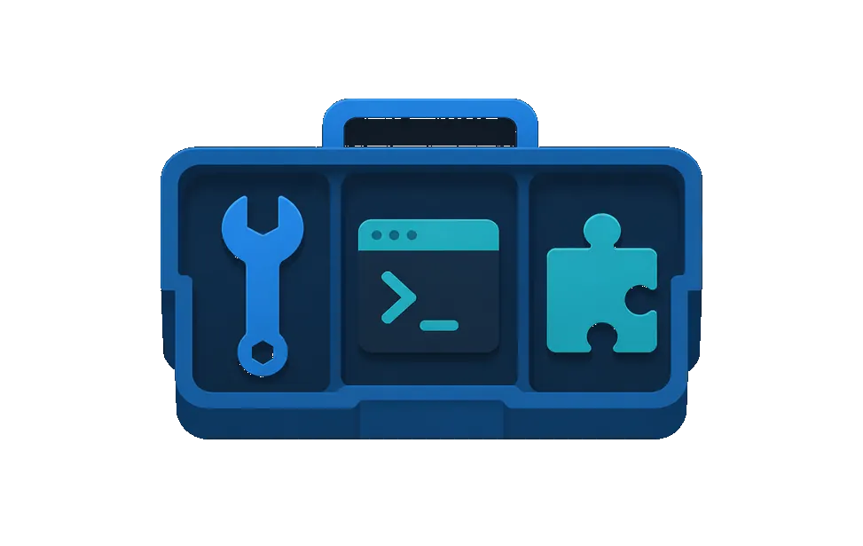{ class="catalogue-logo" data-publish-date="2026-08-01" }

    How to match languages, operating systems, cloud providers, frameworks,
    and databases to what a project actually needs, instead of forcing one
    familiar stack onto every problem.

    Tools
    Engineering

-   **[SAST and DAST](articles/sast-and-dast.md)**

    ---

    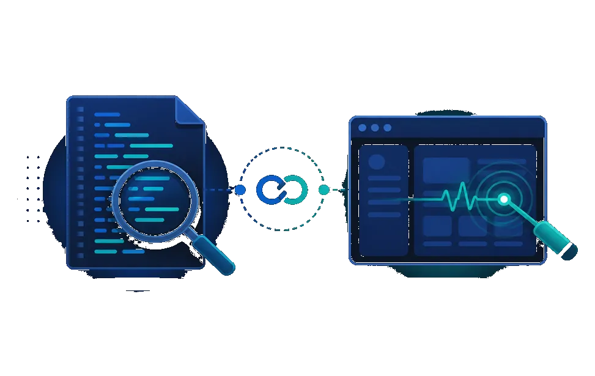{ class="catalogue-logo" data-publish-date="2026-08-01" }

    What static and dynamic application security testing each catch, why
    they find different bugs, and how to run SAST in CI and DAST against a
    deployed environment without drowning the team in findings.

    Security
    Engineering

-   **[Secrets Management](articles/secrets-management.md)**

    ---

    { class="catalogue-logo" data-publish-date="2026-08-01" }

    What counts as a secret, the five ways secrets management usually goes
    wrong, and the practices and tools that keep credentials out of your
    codebase and under control.

    Security
    DevOps

-   **[Secure Defaults](articles/secure-defaults.md)**

    ---

    { class="catalogue-logo" data-publish-date="2026-08-01" }

    Designing secure defaults for tools and libraries. Fail closed, least
    privilege, dangerous features opt-in, and interfaces that make the safe
    path the easy path.

    Security
    Design

-   **[Secure Logging](articles/secure-logging.md)**

    ---

    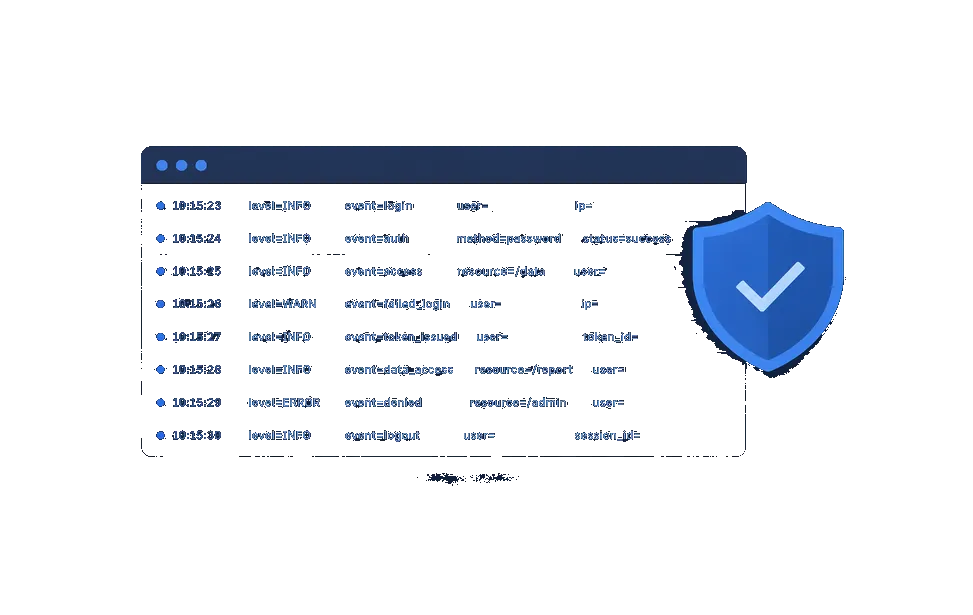{ class="catalogue-logo" data-publish-date="2026-08-01" }

    Practical secure logging for tools and services. What never to log,
    redaction, crash reports, debug flags, and keeping observability from
    becoming a leak.

    Security
    Engineering

-   **[Security by Design](articles/security-by-design.md)**

    ---

    { class="catalogue-logo" data-publish-date="2026-08-01" }

    Security by Design in practice. The principles behind it, why fixing
    flaws at design time is cheaper, and what it looks like applied to
    software, infrastructure, and cloud environments.

    Security
    Design

-   **[Security Disclosures That Work](articles/security-disclosures-that-work.md)**

    ---

    { class="catalogue-logo" data-publish-date="2026-08-01" }

    Practical security disclosure for small open-source projects.
    SECURITY.md, private reporting, triage, credit, and promises maintainers
    can actually keep.

    Security
    Open Source

-   **[Semantic Versioning](articles/semantic-versioning.md)**

    ---

    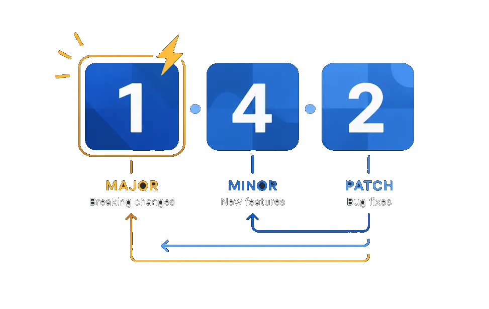{ class="catalogue-logo" data-publish-date="2026-08-01" }

    Semantic versioning as it actually plays out in open-source tools. What
    counts as breaking, how to live in 0.x honestly, why changelogs are part
    of the version number, and how to keep upgrades boring.

    Open Source
    Engineering

-   **[Supply-Chain Signing](articles/supply-chain-signing.md)**

    ---

    { class="catalogue-logo" data-publish-date="2026-08-01" }

    Practical supply-chain signing for open-source releases. Checksums,
    signatures, provenance, and verification steps users can actually
    follow.

    Security
    Open Source

-   **[Testing What Matters](articles/testing-what-matters.md)**

    ---

    { class="catalogue-logo" data-publish-date="2026-08-01" }

    Why high coverage can be a vanity metric, how to test behaviour instead
    of mocks, and how small open-source projects can build a test suite that
    catches real regressions without drowning contributors.

    Engineering
    Testing

-   **[The Cybersecurity Rainbow](articles/the-cybersecurity-rainbow.md)**

    ---

    { class="catalogue-logo" data-publish-date="2026-08-01" }

    A map of the colour-coded cybersecurity teams. Red, Blue, Purple, Green,
    Yellow, Orange, and White, what each one is responsible for, and how
    they fit together into one security programme.

    Security
    Ops

-   **[The Optimisation Trap](articles/the-optimization-trap.md)**

    ---

    { class="catalogue-logo" data-publish-date="2026-08-01" }

    Why capable engineers waste time polishing things that should not exist,
    how to tell warranted optimisation from busywork, and how first
    principles thinking keeps improvements pointed at something that
    matters.

    Engineering
    Mindset

-   **[Threat Modelling for Small Tools](articles/threat-modelling-for-small-tools.md)**

    ---

    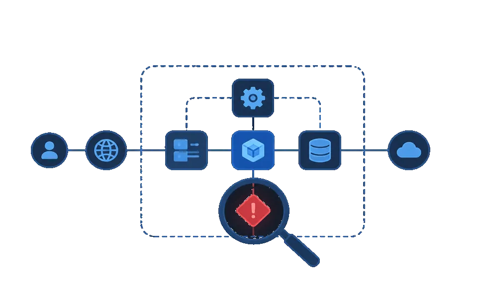{ class="catalogue-logo" data-publish-date="2026-08-01" }

    Lightweight threat modelling for CLIs, libraries, and small services.
    Assets, attackers, trust boundaries, and a practical checklist without
    enterprise ceremony.

    Security
    Engineering

-   **[Understanding CI/CD](articles/understanding-ci-cd.md)**

    ---

    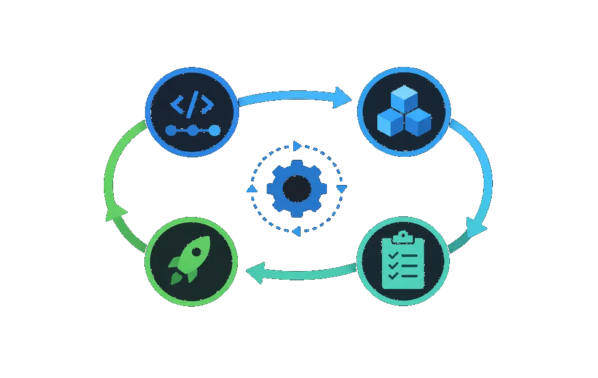{ class="catalogue-logo" data-publish-date="2026-08-01" }

    What continuous integration and continuous delivery buy you, what they
    cost, and the concrete guardrails (feature flags, staging, monitoring,
    canaries, rollbacks) that make automatic deployment survivable.

    CI/CD
    DevOps

:material-magnify: No articles match the current filters.

Try clearing the search or choosing a different tag or status.

