---
hide:
  - navigation
  - toc
---

  

    <label for="article-search">Search articles</label>
    <input
      id="article-search"
      type="search"
      placeholder="Search by title, description, or tag"
      autocomplete="off"
      data-article-search
    />
  

  

    <label for="article-category">Tag</label>
    <select id="article-category" data-article-category>
      <option value="">All tags</option>
    </select>
  

  

    <button
      type="button"
      class="md-button lupaxa-button filter-panel-clear"
      data-article-clear
    >
      Clear filters
    </button>
  

  

    Showing all articles
  

-   **[Agile Vs Waterfall](articles/agile-vs-waterfall.md)**

    ---

    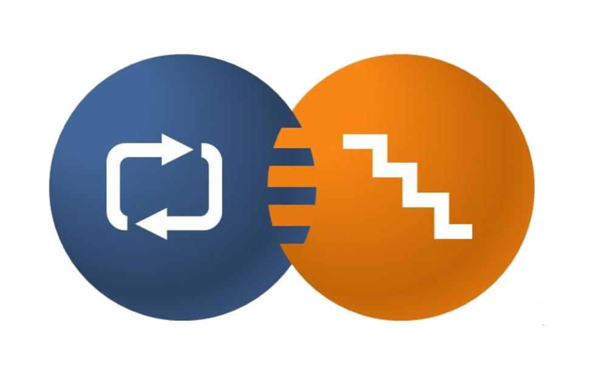{ class="catalogue-logo" }

    Explore Agile vs. Waterfall development methodologies, comparing their
    key differences, pros and cons, and best use cases. Learn how to choose
    the right approach for your software development project and when a
    hybrid model may be the best solution.

    Agile
    Process

-   **[AI & Machine Learning](articles/ai-and-ml.md)**

    ---

    { class="catalogue-logo" }

    Explore the key differences, similarities, and use cases of Artificial
    Intelligence (AI) and Machine Learning (ML). Learn how these
    transformative technologies work independently and together to drive
    innovation across industries.

    AI
    ML

-   **[CLI Design](articles/cli-design.md)**

    ---

    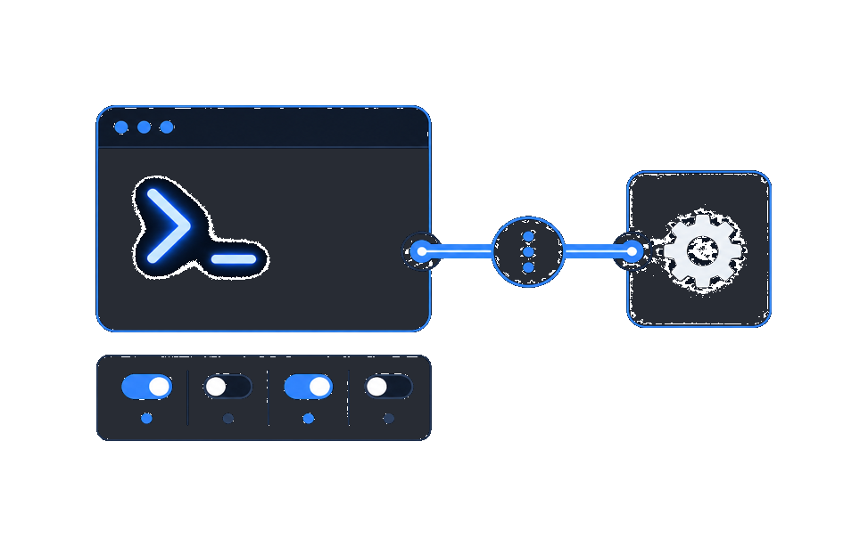{ class="catalogue-logo" }

    Practical CLI design for open-source tools — flags and arguments, exit
    codes, stdout versus stderr, helpful errors, and interfaces that feel
    good in scripts and human hands.

    Engineering
    Tools

-   **[Coding Standards](articles/coding-standards.md)**

    ---

    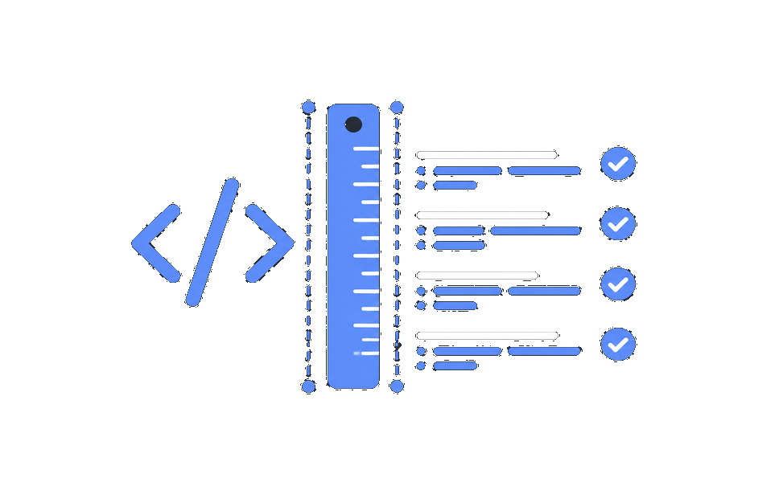{ class="catalogue-logo" }

    Explore the importance of coding standards for consistent, maintainable
    code and discover how automation can simplify enforcement, ensuring
    quality in software development.

    Engineering
    Standards

-   **[Contributing Without the Drama](articles/contributing-without-the-drama.md)**

    ---

    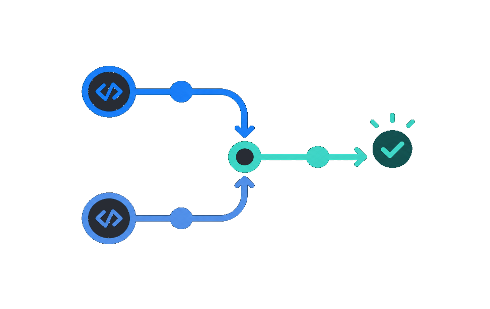{ class="catalogue-logo" }

    Practical guidance for opening useful issues and pull requests in open-
    source projects — small diffs, clear context, good first issues, and
    knowing when not to bikeshed.

    Open Source
    Community

-   **[Cybersecurity & Chess](articles/cybersecurity-and-chess.md)**

    ---

    { class="catalogue-logo" }

    Discover the strategic parallels between cybersecurity and chess, where
    anticipation, adaptation, and calculated risks define success in both
    digital and game-based battlefields.

    Security
    Strategy

-   **[Dependency Hygiene](articles/dependency-hygiene.md)**

    ---

    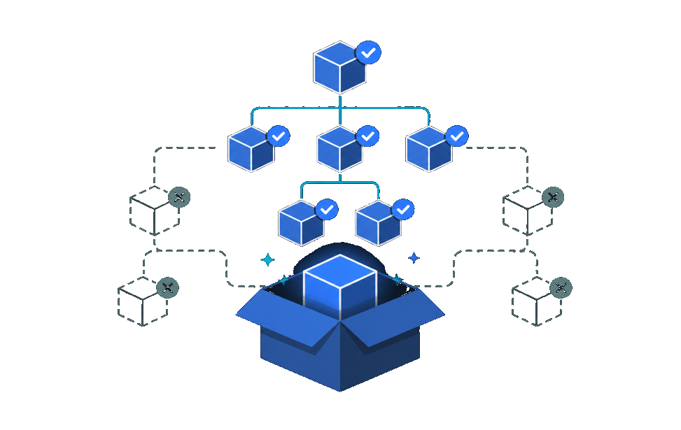{ class="catalogue-logo" }

    Practical dependency hygiene for open-source and small teams — pinning,
    lockfiles, audits, supply-chain basics, and keeping your software supply
    line trustworthy without enterprise ceremony.

    Security
    Engineering

-   **[Developers & AI](articles/developers-and-ai.md)**

    ---

    { class="catalogue-logo" }

    Discover how artificial intelligence (AI) is revolutionizing software
    development. Learn about AI-driven coding, testing, DevOps, project
    management, and how AI enhances the software development lifecycle.

    AI
    Development

-   **[Docs That Don't Rot](articles/docs-that-dont-rot.md)**

    ---

    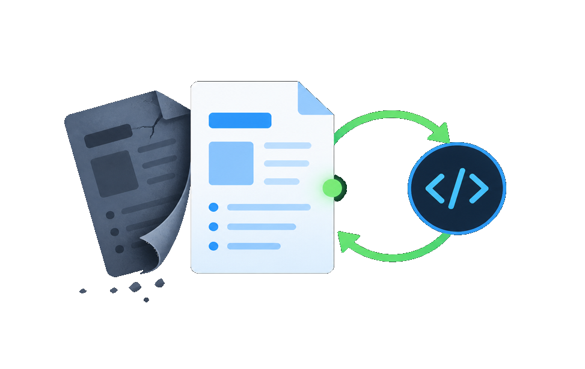{ class="catalogue-logo" }

    How to keep project documentation alive — examples as tests, docs sites
    that ship with releases, screenshots that stay honest, and habits that
    stop docs from quietly lying.

    Documentation
    Open Source

-   **[Don't Fear Failure](articles/dont-fear-failure.md)**

    ---

    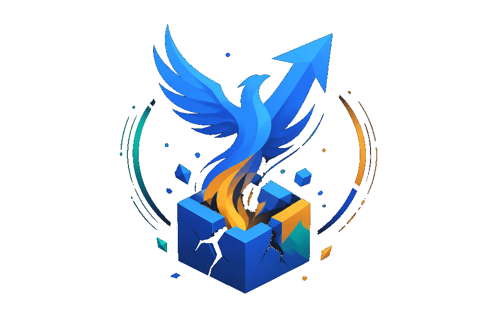{ class="catalogue-logo" }

    Embrace failure as a stepping stone to growth and success, discovering
    how setbacks can build resilience, fuel learning, and lead to greater
    achievements.

    Mindset
    Growth

-   **[Feature Flags](articles/feature-flags.md)**

    ---

    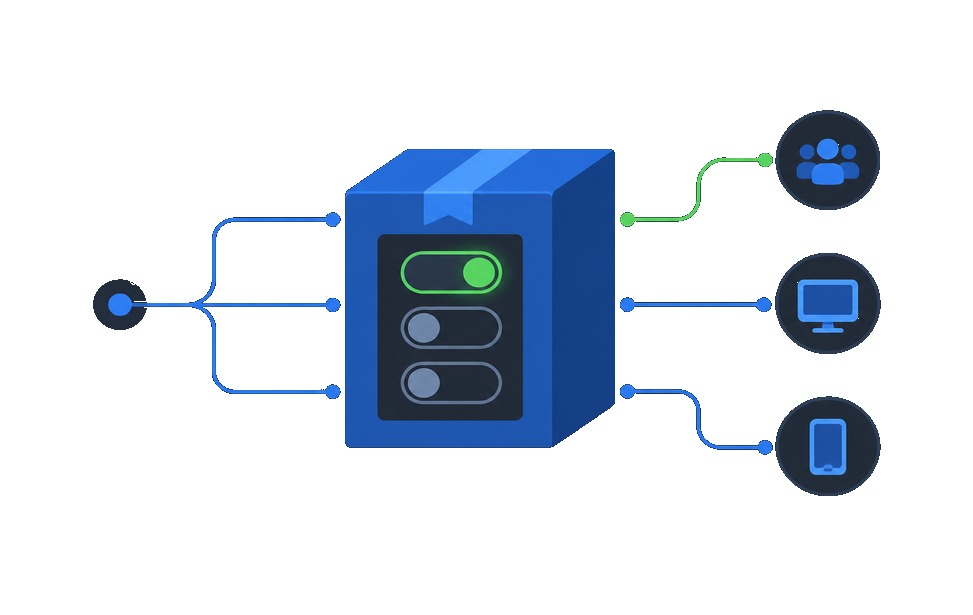{ class="catalogue-logo" }

    Explore the benefits of feature flags in software development, from
    flexible feature releases to enhanced testing and rapid rollbacks, and
    learn best practices for effective flag management.

    Engineering
    Delivery

-   **[GitHub Actions](articles/github-actions.md)**

    ---

    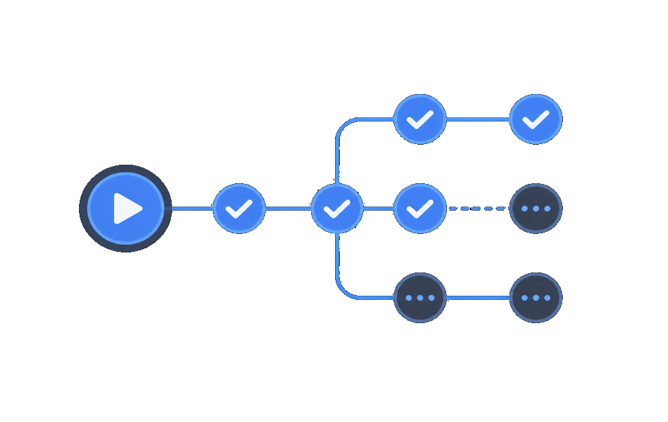{ class="catalogue-logo" }

    Learn how to use GitHub Actions for CI/CD, with a step-by-step guide on
    automating builds, tests, and deployments, complete with YAML
    configurations and best practices.

    CI/CD
    GitHub

-   **[Infrastructure as Code](articles/infrastructure-as-code.md)**

    ---

    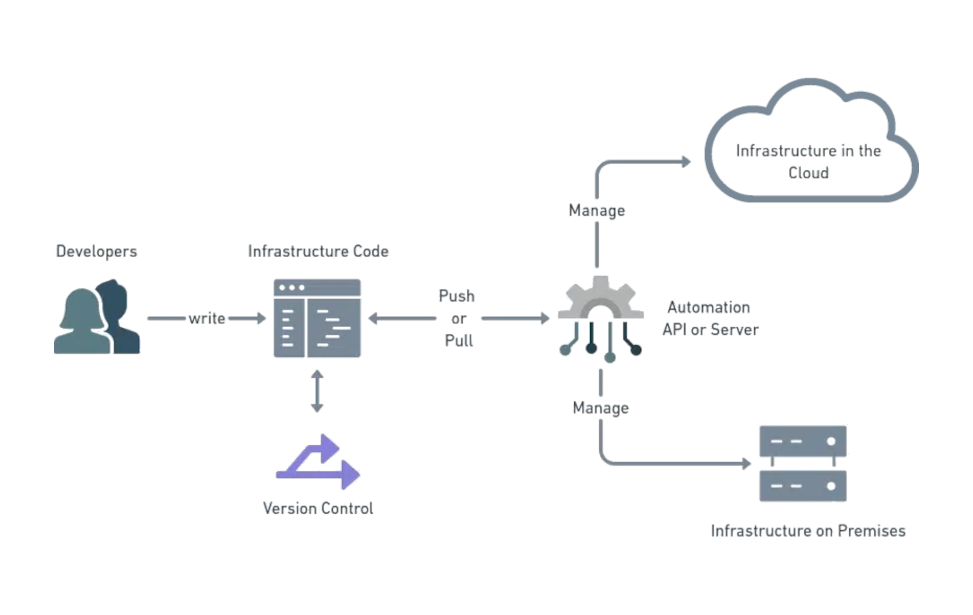{ class="catalogue-logo" }

    Explore the benefits of Infrastructure as Code (IaC), from automation to
    scalability, and learn best practices for treating infrastructure as
    code in modern software development.

    DevOps
    IaC

-   **[Licenses for Humans](articles/licenses-for-humans.md)**

    ---

    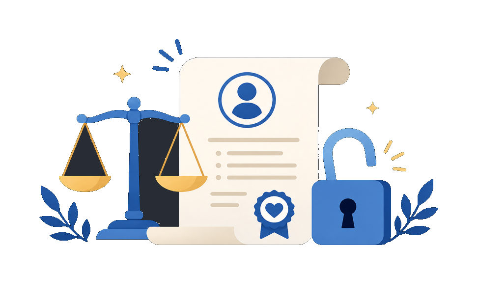{ class="catalogue-logo" }

    A plain-language guide to common open-source licenses for people
    publishing tools — MIT, Apache-2.0, GPL family trade-offs, why LICENSE
    files matter, and how to choose without a law degree.

    Open Source
    Community

-   **[Monoliths Vs Microservices](articles/monoliths-vs-microservices.md)**

    ---

    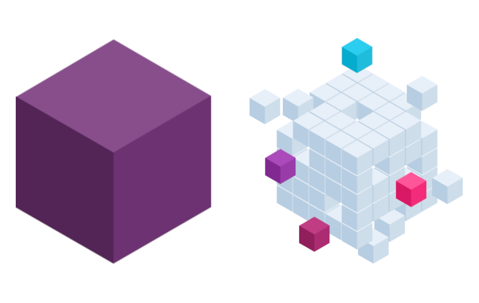{ class="catalogue-logo" }

    Explore the differences between monolithic and microservices
    architectures, their ideal use cases, and the pros and cons of each
    approach to make informed decisions for your software projects.

    Architecture
    Systems

-   **[Never Stop Learning](articles/never-stop-learning.md)**

    ---

    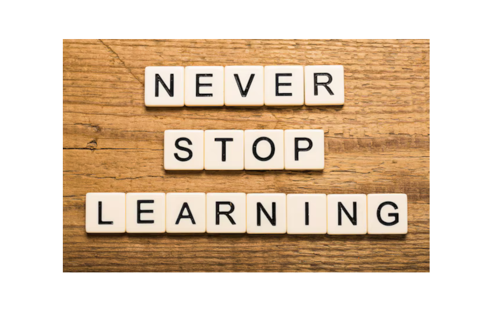{ class="catalogue-logo" }

    Discover why lifelong learning is essential in the software industry,
    how it enhances adaptability and career growth, and strategies for
    integrating continuous learning into your routine.

    Career
    Learning

-   **[Observability for Small Projects](articles/observability-for-small-projects.md)**

    ---

    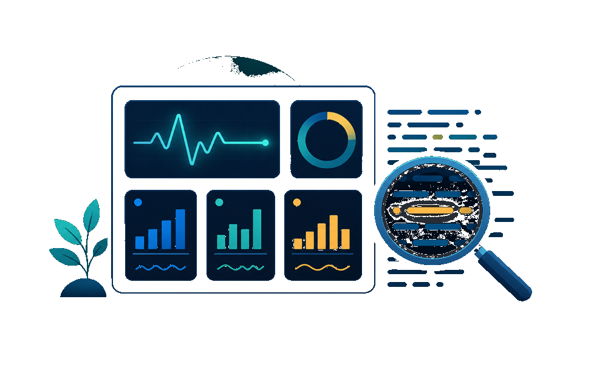{ class="catalogue-logo" }

    Practical observability for CLIs, libraries, and small services — useful
    logs, health signals, failure modes, and knowing what broke without
    needing an enterprise APM stack.

    Engineering
    DevOps

-   **[Programmers Vs Software Engineers](articles/programmers-vs-software-engineers.md)**

    ---

    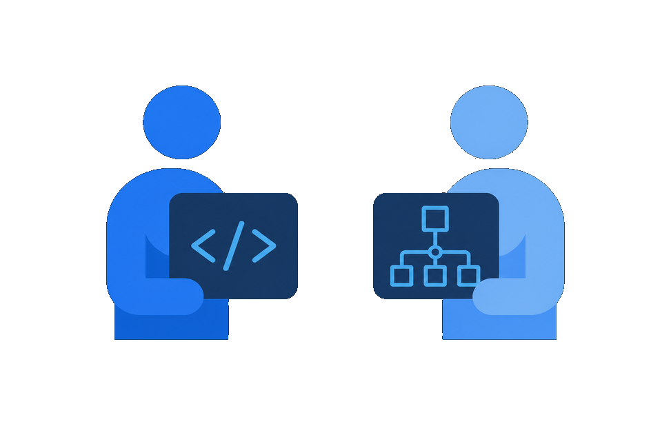{ class="catalogue-logo" }

    Explore the differences between programmers and software engineers,
    their roles, skill sets, and approaches to software development, and why
    an engineering mindset is crucial for long-term success.

    Career
    Engineering

-   **[Programming Fundamentals](articles/programming-fundamentals.md)**

    ---

    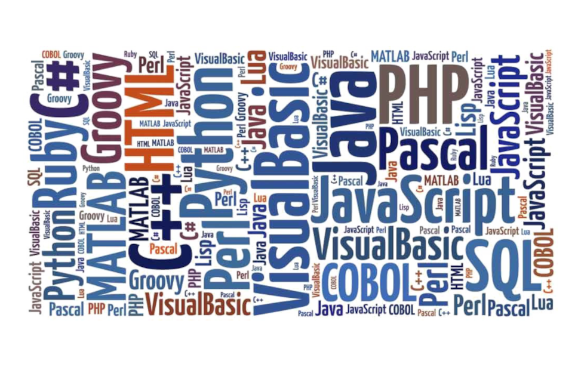{ class="catalogue-logo" }

    Discover why mastering programming principles and fundamentals is more
    valuable than focusing on a specific language, enabling you to adapt,
    debug, and collaborate more effectively in an evolving tech landscape.

    Engineering
    Fundamentals

-   **[Python the Swiss Army Knife](articles/python-the-swiss-army-knife.md)**

    ---

    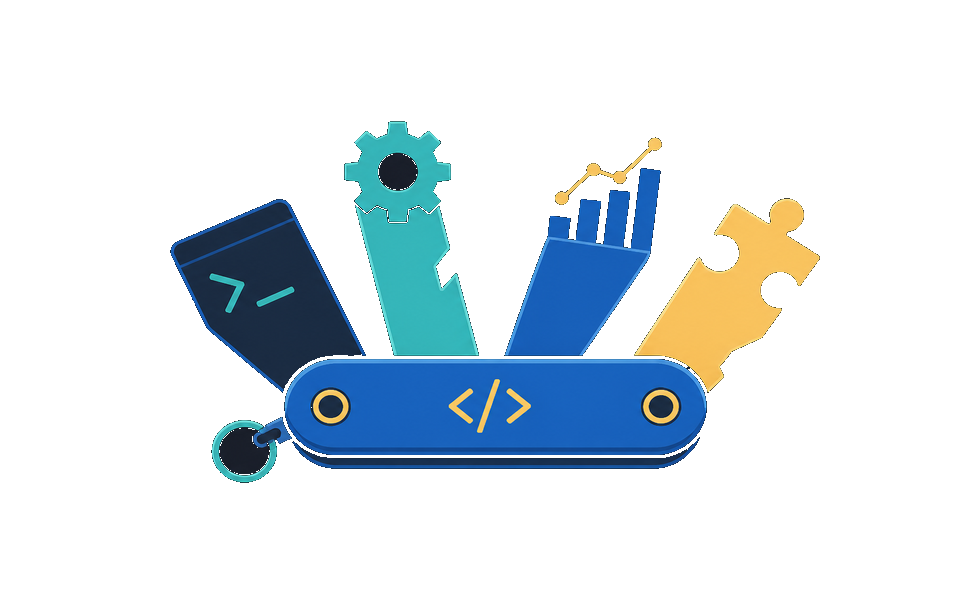{ class="catalogue-logo" }

    Explore why Python is the "Swiss Army knife" of programming. Learn about
    its simplicity, extensive libraries, cross-platform compatibility,
    community support, and versatility across domains like web development,
    data science, automation, and AI.

    Python
    Tools

-   **[README as Product](articles/readme-as-product.md)**

    ---

    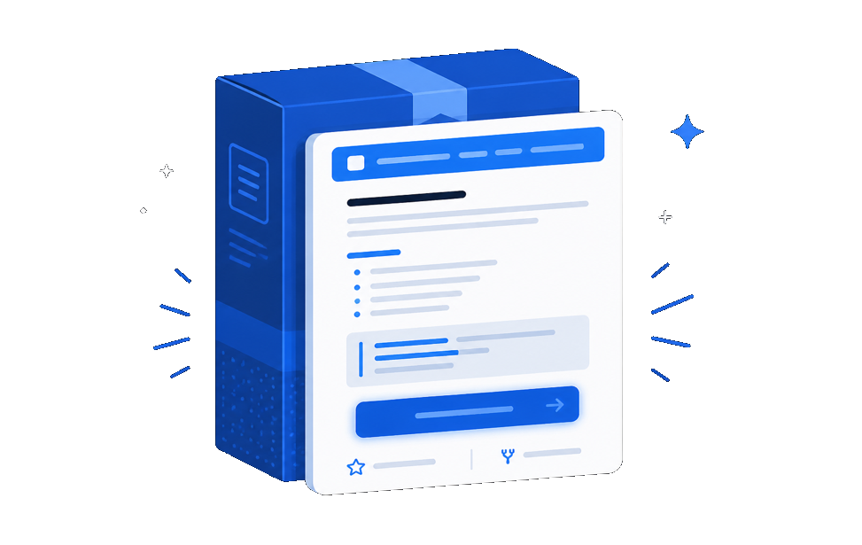{ class="catalogue-logo" }

    Treat your README as the product surface of an open-source project —
    clear install steps, honest examples, trustworthy badges, and a path
    from curiosity to first success.

    Open Source
    Documentation

-   **[Red Team Vs Blue Team](articles/red-team-vs-blue-team.md)**

    ---

    { class="catalogue-logo" }

    Learn the differences between Red Teams and Blue Teams in cybersecurity,
    their roles in attack and defence simulations, and how they work
    together to strengthen an organization's security posture.

    Security
    Ops

-   **[Release Automation](articles/release-automation.md)**

    ---

    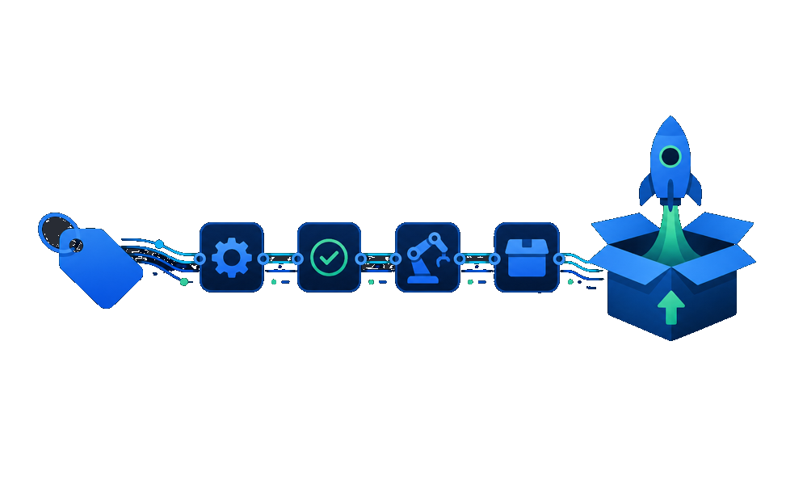{ class="catalogue-logo" }

    How to automate releases for open-source projects — tags, changelogs,
    GitHub Releases, package publishing, and CI checks that make shipping
    routine instead of heroic.

    CI/CD
    Open Source

-   **[Secrets Management](articles/secrets-management.md)**

    ---

    { class="catalogue-logo" }

    Learn the essentials of secrets management, its importance in protecting
    sensitive data, best practices for secure handling, and an overview of
    tools to safeguard your organization's credentials.

    Security
    DevOps

-   **[Security by Design](articles/security-by-design.md)**

    ---

    { class="catalogue-logo" }

    Explore the concept of Security by Design, its importance in building
    resilient systems, and how to apply its principles across software
    development, infrastructure, and cloud environments for proactive
    cybersecurity.

    Security
    Design

-   **[Semantic Versioning](articles/semantic-versioning.md)**

    ---

    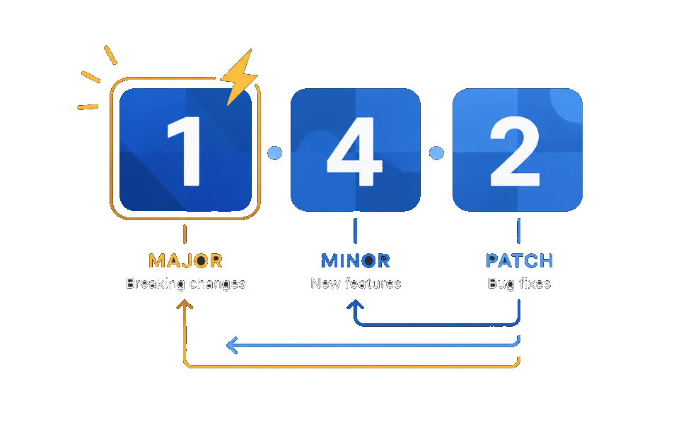{ class="catalogue-logo" }

    A practical guide to semantic versioning for open-source tools — major,
    minor, and patch releases, 0.x realities, deprecations, and
    communicating breaking changes without surprising your users.

    Open Source
    Engineering

-   **[Software Automation](articles/software-automation.md)**

    ---

    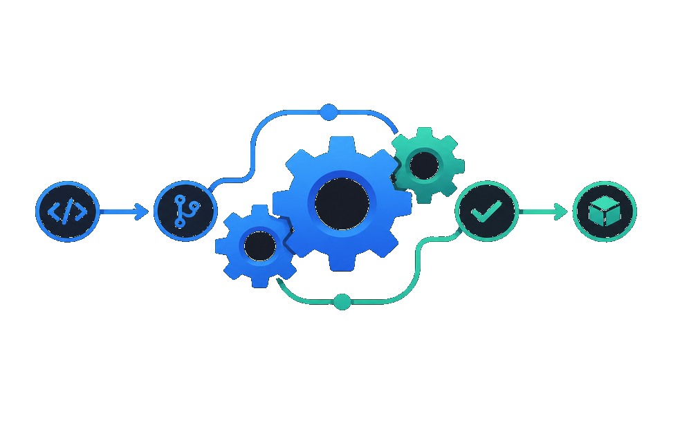{ class="catalogue-logo" }

    Discover how software automation streamlines development, enhances
    security, and ensures consistency, enabling faster, more reliable
    software delivery in today's competitive tech landscape.

    Automation
    DevOps

-   **[Software Development Life Cycle](articles/software-development-life-cycle.md)**

    ---

    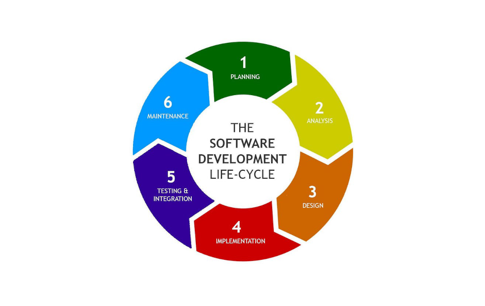{ class="catalogue-logo" }

    Learn about the Software Development Lifecycle (SDLC), its stages, and
    how it helps teams deliver quality software. This guide covers planning,
    design, development, testing, deployment, maintenance, and
    decommissioning in detail.

    Process
    SDLC

-   **[Software Security](articles/software-security.md)**

    ---

    { class="catalogue-logo" }

    Learn about Static Application Security Testing (SAST) and Dynamic
    Application Security Testing (DAST) in software development. Understand
    how these tools help identify and mitigate vulnerabilities, improve
    security, and ensure regulatory compliance.

    Security
    Engineering

-   **[Testing What Matters](articles/testing-what-matters.md)**

    ---

    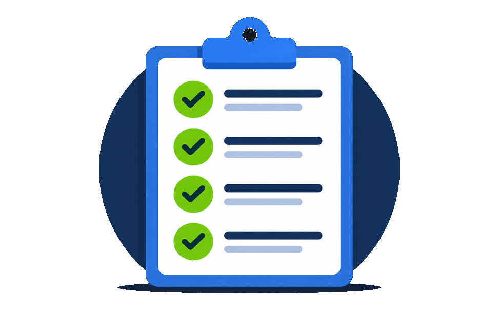{ class="catalogue-logo" }

    Why high coverage can be a vanity metric, how to test behaviour instead
    of mocks, and how small open-source projects can build a test suite that
    catches real regressions without drowning contributors.

    Engineering
    Testing

-   **[The Cybersecurity Rainbow](articles/the-cybersecurity-rainbow.md)**

    ---

    { class="catalogue-logo" }

    Explore the roles of the color-coded cybersecurity teams—Red, Blue,
    Purple, Green, Yellow, Orange, and White—and learn how they contribute
    to a comprehensive, resilient cybersecurity strategy.

    Security
    Ops

-   **[The Optimisation Trap](articles/the-optimization-trap.md)**

    ---

    { class="catalogue-logo" }

    Discover how to avoid the optimisation trap in software engineering.
    Learn why it's essential to focus on purpose-driven improvements,
    inspired by Elon Musk's insights on building the right things, not just
    better things.

    Engineering
    Mindset

-   **[Tools for Jobs](articles/tools-for-jobs.md)**

    ---

    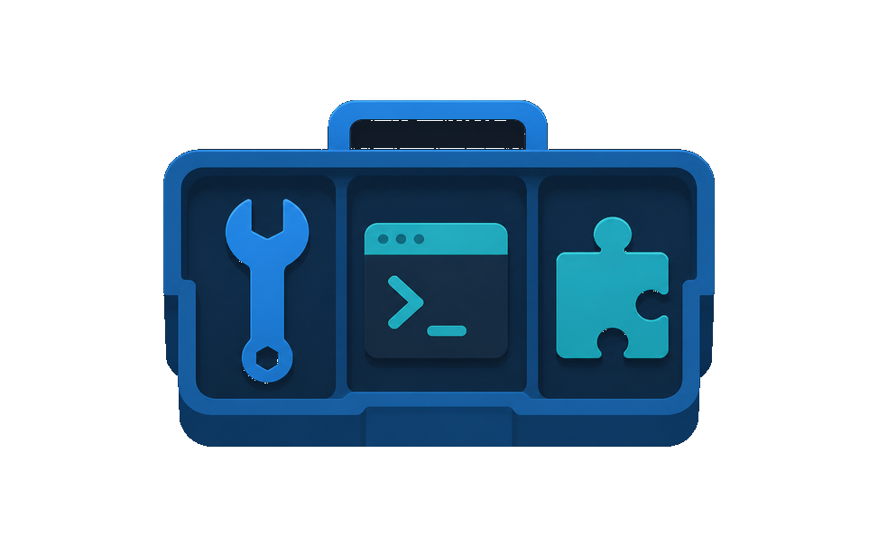{ class="catalogue-logo" }

    Learn why choosing the right tools for the job is crucial in software
    development. Discover how to select the best programming languages,
    operating systems, cloud providers, frameworks, and databases based on
    specific project requirements.

    Tools
    Engineering

-   **[Understanding CI/CD](articles/understanding-ci-cd.md)**

    ---

    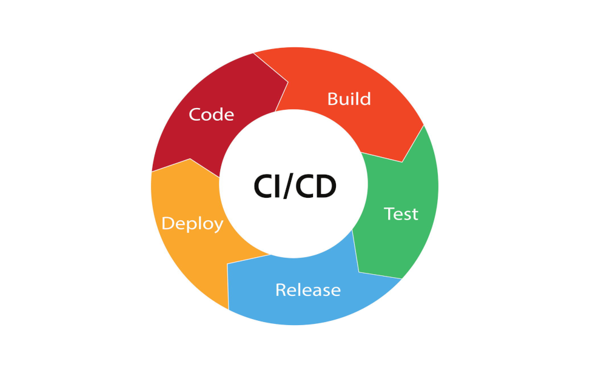{ class="catalogue-logo" }

    Explore the fundamentals of CI/CD in software development. Understand
    the benefits, challenges, and best practices to implement Continuous
    Integration and Continuous Delivery/Deployment effectively.

    CI/CD
    DevOps

:material-magnify: No articles match the current filters.

Try clearing the search or choosing a different tag.

